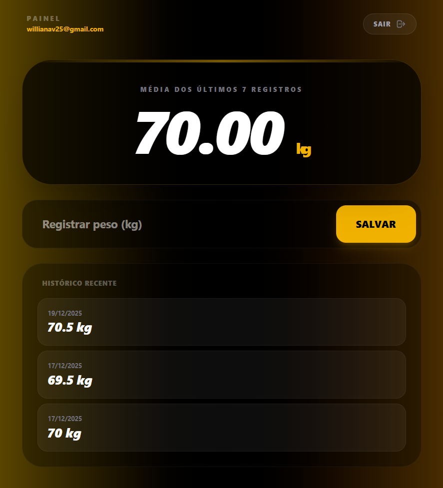

# ⚖️ Weight Trend Calculator

> **Status do Projeto:** 🟢 Em desenvolvimento ativo

Aplicação web desenvolvida para auxiliar no monitoramento do peso corporal com foco na **tendência real de progresso**, ajudando a reduzir a ansiedade causada por flutuações diárias naturais do organismo.

---

## 🖥️ Preview

### Dashboard Principal


### Histórico de Pesagens



> _As imagens acima demonstram o cálculo automático da média móvel, histórico de registros e interface responsiva._

---

## 🎯 O Problema

O peso corporal pode variar significativamente em curtos períodos devido a fatores como:

- Retenção de líquidos
- Estoque de glicogênio
- Inflamação
- Horário da pesagem

Essas variações costumam gerar frustração e interpretações erradas do progresso real, afetando diretamente a **motivação e a saúde mental**.

---

## 💡 A Solução

Este projeto utiliza o conceito da **Média Móvel de 7 dias**, oferecendo uma visão mais estável e realista do progresso:

- **Estabilidade:** Suaviza picos e quedas irreais
- **Clareza:** Evidencia a tendência real (déficit ou superávit calórico)
- **Foco no essencial:** Acompanhamento baseado em progresso semanal

---

## ✨ Funcionalidades

- 🔐 **Autenticação Segura**

  - Cadastro e Login com **Firebase Authentication**

- ⚡ **Dados em Tempo Real**

  - Sincronização instantânea usando **Firestore (onSnapshot)**

- 📊 **Cálculo Automático**

  - Média móvel baseada nos últimos 7 registros de peso

- 🗑️ **Gestão de Histórico**

  - Exclusão de registros inseridos incorretamente

- 📱 **Interface Responsiva**
  - Design moderno em **Glassmorphism**
  - Adaptado para mobile e desktop

---

## 🛠️ Tecnologias Utilizadas

- **React.js**
- **Vite**
- **Tailwind CSS**
- **Firebase**
  - Authentication
  - Firestore
- **React Router DOM**

---

## 🚀 Como rodar o projeto localmente

1. **Clone o repositório**
   ```bash
   git clone [[https://github.com/seu-usuario/seu-repositorio.git](https://github.com/williamav28/seuPesoMedio.git)
   ```
2. **Acesse a pasta:**
   ```bash
      cd seuPesoMedio
   ```
3. Inicie o projeto: Basta abrir o arquivo index.html em qualquer navegador moderno.

4. **Configure o Firebase**

- Crie um projeto no Firebase
- Ative Authentication (Email/Senha)
- Ative o Firestore
- Crie um arquivo `.env` com suas credenciais

5. **Inicie o projeto**

   ```bash
   npm run dev
   ```

6. **Acesse no navegador**
   ```bash
   http://localhost:5173
   ```

## 📚 Aprendizados

Durante este projeto, aprofundei conhecimentos em:

- Arquitetura de aplicações React
- Gerenciamento de estado e efeitos colaterais
- Integração com serviços externos (Firebase)
- Consumo e escuta de dados em tempo real
- Design focado em UX e saúde mental

## 📄 Licença

Este projeto está sob a licença MIT - consulte o arquivo LICENSE para detalhes.

Desenvolvido com 💜 por William Alves
